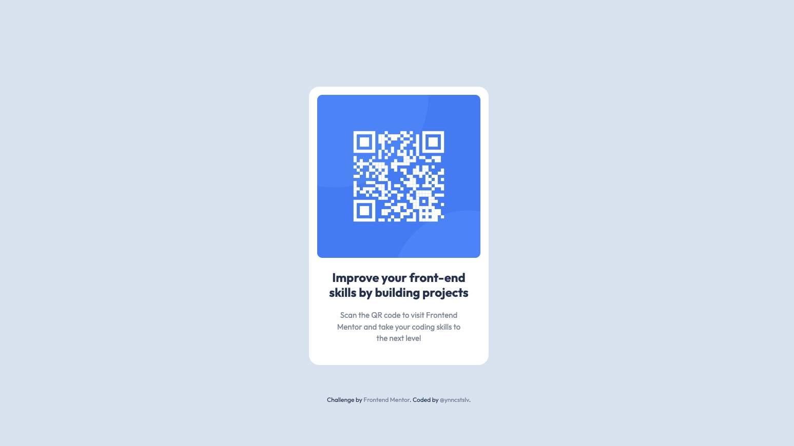

# Frontend Mentor - Product Preview Card Component Solution

This is a solution to the <a href="https://www.frontendmentor.io/challenges/qr-code-component-iux_sIO_H">"QR Code Component Challenge"</a> on Frontend Mentor.
<br>
Frontend Mentor challenges help ypu improve your coding skills by building realistic projects.

# 📖 Table of contents

- [Brief](#📋-brief);
- [Screenshot](#🖥-screenshot);
- [Technologies](#🔧-technologies);
- [Code](#💾-code);
- [Author](#🧔-author);

# 📋 Brief

Build out a QR code component and get it looking as close to the design as possible.
<br>
Use any tools to help the completion of the challenge.
<br>
Users should be able to:
<br>
- View the optimal layout depending on their device's screen size;

# 🖥 Screenshot



# 🔧 Technologies


# 💾 Code

```html
    <body>
        <!-- // main container ===== start -->
        <div class="container-fluid">
            <!-- // card container & rows ===== start -->
            <div class="card-container">
                <!-- // top row ===== start -->
                <div class="top-row">
                    
                </div>
                <!-- // top row ===== end -->
                <!-- // bottom row ===== start -->
                <div class="bottom-row">
                    <h1 id="title">Improve your front-end skills by building projects</h1>
                    <p id="description">Scan the QR code to visit Frontend Mentor and take your coding skills to the next level</p>
                </div>
                <!-- // bottom row ===== end -->
            </div>
            <!-- // card container & rows ===== end -->
            <!-- // attribution ===== start -->
            <div class="attribution">
                Challenge by <a href="https://www.frontendmentor.io?ref=challenge" target="_blank">Frontend Mentor</a>. 
                Coded by <a href="https://github.com/ynncstslv" target="_blank">@ynncstslv</a>.
            </div>
            <!-- // attribution ===== start -->
        </div>
        <!-- // bootstrap js ===== start // -->
        <script src="https://cdn.jsdelivr.net/npm/bootstrap@5.2.0-beta1/dist/js/bootstrap.bundle.min.js" integrity="sha384-pprn3073KE6tl6bjs2QrFaJGz5/SUsLqktiwsUTF55Jfv3qYSDhgCecCxMW52nD2" crossorigin="anonymous"></script>
        <!-- // bootstrap js ===== end // -->
    </body>
```

```css
/* fonts */

@import url('https://fonts.googleapis.com/css2?family=Outfit:wght@400;700&display=swap');

/* color palette */

:root {
    --color-white: hsl(0, 0%, 100%);
    --color-light-gray: hsl(212, 45%, 89%);
    --color-grayish-blue: hsl(220, 15%, 55%);
    --color-dark-blue: hsl(218, 44%, 22%);
}

/* default reset */

* {
    margin: 0;
    padding: 0;
    box-sizing: border-box;
}

body {
    font-family: 'Outfit', sans-serif;
}

p {
    font-size: 15px;
}

/* main container */

.container-fluid {
    width: 100%;
    min-height: 100vh;
    position: relative;
    display: flex;
    align-items: center;
    justify-content: center;
    padding: 2rem;
    background: var(--color-light-gray);
    overflow: hidden;
}

/* card container & rows */

.card-container {
    width: 100%;
    max-width: 350px;
    border-radius: 20px;
    background: var(--color-white);
    overflow: hidden;
}

.top-row {
    padding: 1rem;
}

.top-row img {
    width: 100%;
    border-radius: 10px;
}

.bottom-row {
    padding: 0.5rem 1.5rem;
    text-align: center;
}

/* information */

#title {
    margin-bottom: 1.2rem;
    font-weight: 700;
    font-size: 24px;
    color: var(--color-dark-blue);
}

#description {
    margin-bottom: 2rem;
    padding: 0 1.2rem;
    color: var(--color-grayish-blue);
}

/* attribution */

.attribution {
    position: absolute;
    bottom: 100px;
    font-size: 12px;
    color: var(--color-dark-blue);
}

.attribution a {
    text-decoration: none;
    color: var(--color-grayish-blue);
    transition: all 0.3s ease 0s;
}

.attribution a:hover {
    color: var(--color-dark-blue);
}

/* media query */

@media (max-width: 375px) {
    .bottom-row {
        padding: 0.5rem 1rem;
    }

    .title {
        font-size: 20px;
    }
    
    #description {
        padding: 0 0.5rem;
    }

    .attribution {
        bottom: 40px;
    }
}
```

# 🧔 Author

- <a href="https://github.com/ynncstslv" target="_blank">GitHub</a>;
- <a href="https://linkedin.com/in/ynncstslv" target="_blank">LinkedIn</a>;
- <a href="https://codepen.io/ynncstslv" target="_blank">Codepen</a>;
- <a href="https://instagram.com/ynncstslv" target="_blank">Instagram</a>;
- <a href="https://twitter.com/ynncstslv" target="_blank">Twitter</a>;